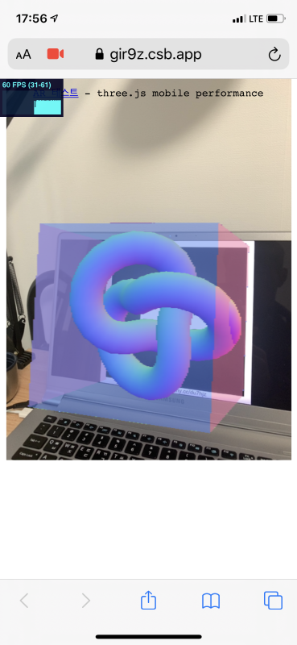

이 저장소는 '20-1학기 웹정보시스템 과목에 AR을 사용하기 위한 테스트 저장소입니다.

참고한 코드 사이트는 아래와 같습니다.

* https://github.com/jeromeetienne/AR.js/blob/master/three.js/examples/mobile-performance.html

배포시 참고할 만한 사이트는 아래와 같습니다.

* https://raw.githack.com  raw.githack.com serves raw files directly from GitHub, Bitbucket or GitLab with proper Content-Type headers
* https://zeit.co World-Class Static Hosting

3D 모델을 제작할 때 참고할 만한 사이트는 아래와 같습니다.

* https://www.3dslash.net  Online 3D modeling software

온라인 이미지 필터링 참고할 만한 사이트는 아래와 같습니다.

* http://evanw.github.io/glfx.js/demo/

실행결과

